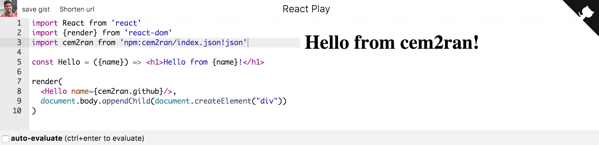

React Play
==

A playground for React powered by [SystemJS](https://github.com/systemjs/systemjs), a universal module loader, capable of running in the browser and pull in dependencies from npm, github and more, through [jspm.io](http://jspm.io/).

There are several ways to share your experiments. Simply copy the link, shorten it, or create a downloadable gist by logging in.

##[DEMO](https://goo.gl/DS1fHW)

